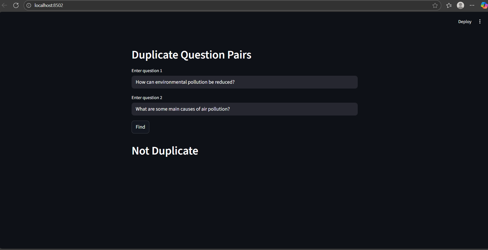
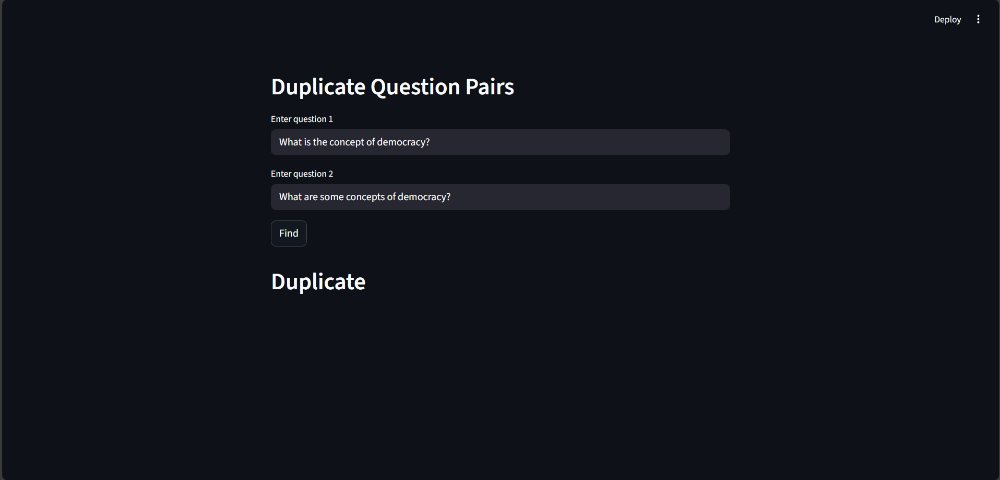

# Quora Duplicate Question Pairs

## �️ Demo Screenshots
Below are example screenshots of the web app in action:

### Not Duplicate Prediction Example


### Duplicate Prediction Example


## ���🚀 Project Overview
This project helps you automatically detect whether two questions asked on Quora are duplicates. It uses powerful machine learning and natural language processing (NLP) techniques to analyze question pairs, extract meaningful features, and predict if they are asking the same thing. This can save time, improve search results, and help organize large Q&A platforms.

## 📦 Dataset Details
- **train.csv**: The main dataset contains thousands of question pairs. Each row has:
  - `qid1`, `qid2`: Unique IDs for each question.
  - `question1`, `question2`: The actual questions in text.
  - `is_duplicate`: 1 if the questions are duplicates, 0 otherwise.
- **How question IDs work**: Each question has a unique ID, but the same question can appear in many pairs. For example, if question ID `2561` appears 88 times, it means that question was compared with 88 other questions.

## 🧩 Main Features & Workflow
1. **Exploratory Data Analysis (EDA)**
	- Understand the data: missing values, duplicate rows, repeated questions.
	- Visualize distributions and relationships using Jupyter notebooks.
2. **Feature Engineering**
	- Extract features like word overlap, token similarity, and bag-of-words (BoW) representations.
	- Use advanced NLP tools to capture the meaning and structure of questions.
3. **Model Training & Evaluation**
	- Train machine learning models (XGBoost, scikit-learn, etc.) to classify question pairs.
	- Evaluate model performance and tune for best results.
4. **Interactive Web App**
	- Use the Streamlit app to enter any two questions and instantly see if they are duplicates.

## 🗂️ Project Structure
- `hello.py`: Simple script to test your environment.
- `streamlit_app/`: Contains the interactive web app and helper functions.
  - `app.py`: Main Streamlit interface for predictions.
  - `helper.py`: Functions for text cleaning, feature extraction, and more.
- Jupyter notebooks for EDA, feature engineering, and model building.
- `requirements.txt` & `pyproject.toml`: All required Python packages listed for easy setup.
- Pre-trained model and vectorizer files (`model.pkl`, `cv.pkl`).

## 🛠️ Installation & Setup
1. **Clone the repository**
	```
	git clone https://github.com/Code-With-Samuel/Quora-Duplicate-Question-Pairs.git
	cd Quora-Duplicate-Question-Pairs
	```
2. **Install dependencies**
	```
	pip install -r requirements.txt
	```
3. **(Optional) Create a virtual environment**
	```
	python -m venv venv
	venv\Scripts\activate  # On Windows
	source venv/bin/activate  # On Mac/Linux
	```

## 💡 How to Use
### 1. Explore the Data
- Open Jupyter notebooks (like `initial_EDA.ipynb`) to understand and visualize the dataset.

### 2. Train & Test Models
- Use the provided notebooks and scripts to train your own models or use the pre-trained ones.

### 3. Try the Web App
- Run the Streamlit app:
	```
	streamlit run streamlit_app/app.py
	```
- Enter any two questions and get an instant prediction: "Duplicate" or "Not Duplicate".

## 🔍 Key Concepts Explained Simply
- **Question IDs**: Each question has a unique number, but popular questions can appear in many pairs. This helps us find which questions are asked most often.
- **Feature Extraction**: The code looks at things like how many words are shared, how similar the sentences are, and other smart ways to compare questions.
- **Value Counts**: Shows how many times each question is used. If a question is repeated a lot, it might be a common or trending topic.

## 📊 Example
Suppose you see this output:
```
2561      88
30782     120
4044      111
...
```
This means question ID `2561` was involved in 88 different pairs. It does NOT mean there are 88 different questions with that ID—just that it was compared with 88 other questions.

## 🧪 Dependencies
Main Python libraries used:
- numpy, pandas, seaborn, matplotlib, scikit-learn, xgboost, distance, fuzzywuzzy, nltk, BeautifulSoup4, plotly, streamlit

## 🌟 Why This Project?
- Helps Quora and similar platforms keep their content clean and organized.
- Saves users time by reducing duplicate answers.
- Demonstrates practical use of NLP and machine learning for real-world problems.

## 📄 License
MIT License (add details if needed)

---
**This project is designed to be beginner-friendly, well-documented, and easy to extend. Whether you want to learn about NLP, build your own duplicate detection system, or just explore a cool dataset, this repository is a great place to start!**
